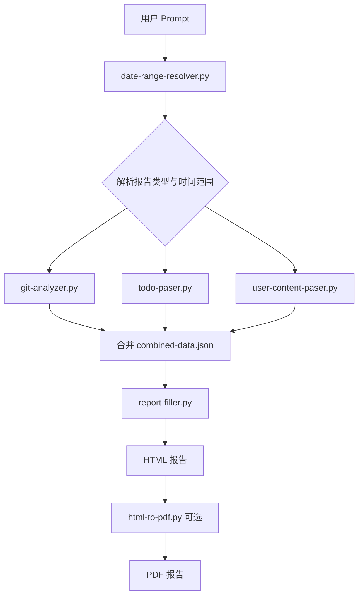

# 日报 / 周报 / 月报生成器

根据用户 **prompt** 自动识别报告类型，从 Git 提交、Todo/Issue 和用户内容文件中收集项目进展，生成结构化的 **HTML / PDF** 工作报告。

本项目同时提供 [SKILL.md](SKILL.md) 作为 Cursor Agent 技能定义，可在对话中直接触发报告生成。

## 功能特性

- **Prompt 驱动**：自然语言描述需求，自动识别日报 / 周报 / 月报及时间范围
- **多数据源聚合**：Git 提交日志、Todo/Issue 文件、用户 Markdown 内容
- **统一报告结构**：8 个标准章节，按报告类型动态切换标题（如今日进展 / 本周进展 / 本月进展）
- **HTML + PDF 输出**：内置 HTML 模板，可选转换为 PDF
- **非 Git 项目友好**：无 Git 仓库时跳过提交分析，仍可基于 Todo 和用户内容生成报告

## 支持的报告类型

| 类型 | 标识 | 触发示例 | 默认时间范围 | 输出文件前缀 |
|------|------|----------|--------------|--------------|
| 日报 | `daily` | 「生成今天的日报」 | 当天 | `daily-report-` |
| 周报 | `weekly` | 「生成本周周报」 | 本周一至周日 | `weekly-report-` |
| 月报 | `monthly` | 「生成本月月报」 | 本月首日至末日 | `monthly-report-` |

未在 prompt 中明确报告类型时，**默认生成周报**。

## 工作流程



## 环境要求

| 依赖 | 说明 |
|------|------|
| Python 3.8+ | 运行所有脚本 |
| Git | 可选，用于提交分析 |
| wkhtmltopdf / weasyprint / pyppeteer | 可选，三选一，用于 PDF 转换 |

```bash
# PDF 转换（任选其一）
pip install weasyprint
# 或 pip install pyppeteer
# 或 brew install wkhtmltopdf
```

## 运行方式

本项目支持三种运行方式，按使用场景选择即可。

### 方式一：Cursor Agent（推荐）

将本项目作为 Cursor Skill 使用，在对话中直接用自然语言描述需求，Agent 会自动执行完整流程。

**配置步骤：**

1. 将 `weekly-report-generator` 目录加入 Cursor Skills（或在工作区中直接引用 [SKILL.md](SKILL.md)）
2. 在目标项目目录打开 Cursor，确保该项目为 Git 仓库（可选）
3. （可选）在项目根目录准备 `problems.md`、`growth.md`、`knowledge.md` 等用户内容文件

**对话示例：**

```
帮我生成今天的日报
生成本周的项目周报
生成上个月的月报，项目路径在 /path/to/my-project
```

Agent 会自动调用各脚本，最终输出 HTML（及 PDF）文件。

---

### 方式二：命令行一键运行

在项目根目录执行 `generate.sh`，传入 prompt 即可生成报告。所有中间文件和输出默认保存在 `./output/` 目录。

```bash
# 进入项目目录
cd weekly-report-generator

# 添加执行权限（首次）
chmod +x generate.sh

# 用法：./generate.sh "<prompt>" [项目路径] [输出目录]
./generate.sh "帮我生成本周的周报"
./generate.sh "帮我生成今天的日报"
./generate.sh "生成上个月的月报" /path/to/my-project
./generate.sh "生成本周周报" . ./reports
```

脚本依次执行：解析 Prompt → 收集 Git/Todo/用户内容 → 合并数据 → 生成 HTML → 尝试生成 PDF。

---

### 方式三：命令行分步运行

适合调试单个脚本或自定义数据合并逻辑，完整步骤见下方「快速开始」。

**运行前注意：**

| 事项 | 说明 |
|------|------|
| 工作目录 | 所有命令均在 `weekly-report-generator/` 根目录执行 |
| Python 命令 | 使用 `python3`（或 `python`，需 3.8+） |
| 项目路径 | 数据收集脚本通过 `--repo-path` 指定要分析的目标项目 |
| 用户内容 | 在目标项目中放置 `problems.md` 等文件（可选） |
| Git 仓库 | 非 Git 项目跳过 `git-analyzer.py` 即可 |

**查看输出：**

```bash
# 在浏览器中打开 HTML 报告
open output/weekly-report-2024-01-21.html        # macOS
xdg-open output/weekly-report-2024-01-21.html    # Linux
start output/weekly-report-2024-01-21.html       # Windows
```

---

### 运行方式对比

| 方式 | 适用场景 | 是否需要手动合并 JSON |
|------|----------|----------------------|
| Cursor Agent | 日常快速生成，自然语言交互 | 否 |
| 一键脚本 | 本地批量生成、CI 集成 | 否 |
| 分步命令行 | 调试脚本、自定义数据源 | 是 |

## 快速开始

### 1. 解析用户 Prompt

```bash
python scripts/date-range-resolver.py --prompt "帮我生成本月的月报"
```

输出 JSON 示例：

```json
{
  "report_type": "monthly",
  "report_title": "工作月报",
  "start_date": "2024-01-01",
  "end_date": "2024-01-31",
  "period_label": "2024-01-01 ~ 2024-01-31",
  "output_html": "monthly-report-2024-01-31.html",
  "output_pdf": "monthly-report-2024-01-31.pdf",
  "labels": {
    "progress": "本月进展",
    "plan": "下月计划"
  }
}
```

将输出保存为 `report-meta.json`，后续步骤使用其中的日期与文件名。

也可显式指定参数：

```bash
python scripts/date-range-resolver.py \
  --type weekly \
  --start-date 2024-01-08 \
  --end-date 2024-01-14
```

### 2. 收集数据

```bash
# Git 提交（日期来自上一步）
python scripts/git-analyzer.py \
  --start-date 2024-01-01 \
  --end-date 2024-01-31 \
  --repo-path . \
  > git-data.json

# Todo / Issue
python scripts/todo-paser.py --repo-path . > todo-data.json

# 用户内容（problems / growth / knowledge）
python scripts/user-content-paser.py --repo-path . > user-content-data.json
```

### 3. 合并数据

将各脚本输出与 `report_meta` 合并为 `combined-data.json`：

```json
{
  "report_meta": { "...date-range-resolver 输出..." },
  "git": { "...git-analyzer 输出..." },
  "todo": { "...todo-paser 输出..." },
  "user_content": { "...user-content-paser 输出..." }
}
```

### 4. 生成 HTML 报告

```bash
python scripts/report-filler.py \
  --template assets/report-template.html \
  --data combined-data.json \
  --output monthly-report-2024-01-31.html \
  --report-meta report-meta.json
```

若 `combined-data.json` 已包含 `report_meta` 字段，可省略 `--report-meta`。

### 5. 生成 PDF（可选）

```bash
python scripts/html-to-pdf.py \
  --input monthly-report-2024-01-31.html \
  --output monthly-report-2024-01-31.pdf
```

## Prompt 识别规则

`date-range-resolver.py` 支持以下自然语言输入：

| 关键词 | 报告类型 | 时间范围 |
|--------|----------|----------|
| 日报、今天、今日、daily report | daily | 当天 |
| 周报、本周、这周、weekly report | weekly | 本周一至周日 |
| 月报、本月、这个月、monthly report | monthly | 本月首日至末日 |
| 昨天、昨日 | daily | 前一天 |
| 上周、上星期 | weekly | 上一自然周 |
| 上月、上个月 | monthly | 上一自然月 |
| `2024-01-01 到 2024-01-07` | 自动推断 | 指定范围 |
| `2024年1月` / `1月`（含月报语义） | monthly | 指定月份 |

## 报告结构

所有报告类型共用 8 个章节，标题随类型变化：

| # | 章节 | 日报 | 周报 | 月报 |
|---|------|------|------|------|
| 1 | 数据统计 | 数据统计 | 数据统计 | 数据统计 |
| 2 | 进展 | 今日进展 | 本周进展 | 本月进展 |
| 3 | 任务完成情况 | 任务完成情况 | 任务完成情况 | 任务完成情况 |
| 4 | 遇到的问题 | 今日遇到的问题 | 本周遇到的问题 | 本月遇到的问题 |
| 5 | 个人成长 | 今日学习成长 | 本周个人成长 | 本月个人成长 |
| 6 | 知识分享 | 知识分享 | 相关知识分享 | 相关知识分享 |
| 7 | 计划 | 明日计划 | 下周计划 | 下月计划 |
| 8 | 风险与问题 | 风险与问题 | 风险与问题 | 风险与问题 |

详细结构说明见 [references/report-structure.md](references/report-structure.md)。

## 数据源说明

### Git 提交（git-analyzer.py）

- 提取指定日期范围内的 `git log` 记录
- 按提交信息关键词自动分类：功能开发、问题修复、技术改进、文档更新
- 统计提交总数与参与人数

### Todo / Issue（todo-paser.py）

自动扫描以下文件：

- `todo*.md` / `todo*.txt` / `TODO.md` / `.todo.md`
- `issue*.md` / `issue*.txt` / `ISSUES.md` / `.issues.md`

支持 `- [x]` / `- [ ]` 复选框、数字编号、优先级标记（`[P0]` 等）。

### 用户内容（user-content-paser.py）

| 类别 | 支持的文件名 | 内容 |
|------|-------------|------|
| problems | `problems.md`、`问题.md`、`issues.md` | 问题描述、解决方案、经验教训 |
| growth | `growth.md`、`成长.md`、`learning.md` | 个人成长与学习记录 |
| knowledge | `knowledge.md`、`知识.md` | 技术知识分享与链接 |

以上文件均为**可选**，缺失时对应章节显示占位提示。

详细提取规则见 [references/data-extraction.md](references/data-extraction.md)。

## 项目结构

```
weekly-report-generator/
├── README.md                       # 项目说明（本文件）
├── SKILL.md                        # Cursor Agent 技能定义
├── generate.sh                     # 一键生成脚本
├── assets/
│   └── report-template.html        # HTML 报告模板
├── scripts/
│   ├── date-range-resolver.py      # Prompt 解析 → 报告类型 + 时间范围
│   ├── git-analyzer.py             # Git 提交分析
│   ├── todo-paser.py               # Todo / Issue 解析
│   ├── user-content-paser.py       # 用户内容提取
│   ├── report-filler.py            # 数据填充 → HTML
│   └── html-to-pdf.py              # HTML → PDF
└── references/
    ├── data-extraction.md          # 数据提取规则
    ├── report-structure.md         # 报告章节结构
    └── template-filling.md         # 模板占位符说明
```

## 脚本参考

### date-range-resolver.py

```bash
python scripts/date-range-resolver.py \
  [--prompt "用户描述"] \
  [--type daily|weekly|monthly] \
  [--start-date YYYY-MM-DD] \
  [--end-date YYYY-MM-DD] \
  [--reference-date YYYY-MM-DD]
```

### git-analyzer.py

```bash
python scripts/git-analyzer.py \
  --start-date YYYY-MM-DD \
  --end-date YYYY-MM-DD \
  [--repo-path .]
```

### todo-paser.py

```bash
python scripts/todo-paser.py \
  [--repo-path .] \
  [--output-format json|summary]
```

### user-content-paser.py

```bash
python scripts/user-content-paser.py \
  [--repo-path .] \
  [--category problems|growth|knowledge|all]
```

### report-filler.py

```bash
python scripts/report-filler.py \
  --template assets/report-template.html \
  --data combined-data.json \
  --output <输出路径.html> \
  [--start-date YYYY-MM-DD] \
  [--end-date YYYY-MM-DD] \
  [--report-meta report-meta.json]
```

### html-to-pdf.py

```bash
python scripts/html-to-pdf.py \
  --input <输入.html> \
  --output <输出.pdf> \
  [--page-size A4] \
  [--margin-top 20mm] \
  [--no-background]
```

## 使用示例

**生成今日日报**

```bash
python scripts/date-range-resolver.py --prompt "帮我生成今天的日报"
# → daily-report-YYYY-MM-DD.html
```

**生成本周周报**

```bash
python scripts/date-range-resolver.py --prompt "生成本周周报"
# → weekly-report-YYYY-MM-DD.html（结束日期为周日）
```

**生成指定范围周报**

```bash
python scripts/date-range-resolver.py --prompt "生成 2024年1月1日到7日的周报"
# → report_type=weekly, start=2024-01-01, end=2024-01-07
```

**指定项目目录**

在各数据收集脚本中使用 `--repo-path /path/to/project` 指向目标项目。

## Agent 技能用法

将本项目作为 Cursor Skill 使用时，Agent 会按 [SKILL.md](SKILL.md) 中定义的流程：

1. 解析用户 prompt 确定报告类型与时间范围
2. 依次运行数据收集脚本
3. 合并数据并填充模板
4. 可选生成 PDF

典型触发语句：

- 「帮我生成今天的日报」
- 「生成本周的项目周报」
- 「生成上个月的月报」

## 注意事项

- 非 Git 仓库项目可跳过 `git-analyzer.py`，报告仍可生成
- 用户内容文件缺失时，对应章节显示「未找到文件」占位，不影响其他章节
- PDF 转换失败时仍会输出 HTML，可手动打印或安装转换工具后重试
- 输出文件命名格式：`{daily|weekly|monthly}-report-{结束日期}.html`

## 参考文档

- [数据提取规则](references/data-extraction.md)
- [报告结构规范](references/report-structure.md)
- [模板填充逻辑](references/template-filling.md)
- [Agent 技能定义](SKILL.md)
